# MockExchange Monorepo

**_Trade without fear, greed, or actual money — because sometimes the best way to lose less is to not play at all._**

This repository contains the full **MockExchange** paper-trading platform:
- **Backend** – Full matching engine, portfolio tracking, and API layer.
- **Deck** – Streamlit-based dashboard for visualizing portfolio and orders.

## TL;DR

- Stateless, deterministic, no-risk spot-exchange emulator.
- ccxt-compatible API — test bots without touching live markets.
- Pluggable market data feed (e.g., Binance via CCXT).
- Companion Streamlit dashboard for monitoring balances & orders.
- Full CLI + REST API + Docker support.

---

## 📜 Story

> It was **2013**, and Bitcoin had just hit a jaw-dropping **$300**.  
> Someone in our old engineering WhatsApp group brought it up.  
> I asked innocently, *“What’s that?”*  
>  
> The response came instantly, dripping with confidence:  
> *“You’re too late — this bubble is about to burst…”*  
>  
> Which, in hindsight, was probably the most confidently
> wrong (and overly cautious) financial advice I’ve ever received.

But something about it intrigued me. I didn’t fully understand it.  
I didn’t even think it would work — and yet, I bought in.  
Just **2/3 of a BTC**, about **180 €**, which, at the time, I mentally wrote off as *“money I’ll never see again.”*  
Spoiler: it was the **best terrible financial decision** I’ve ever made.

I held.  
And held.  
And held some more.

Then came **2017** — the year of Lambos, moon memes, and FOMO-induced insomnia.  
I began checking prices at night before bed, and again first thing in the morning —
not for fun, but to confirm whether I was now rich… or still stuck working 9 to 5.

This, of course, led me to the **classic rookie move**: diversification.  
I dove into altcoins with names like **LTC**, **TROY**, and others I’ve repressed like a bad haircut from high school.  
Let’s just say: they didn’t go to the moon — they dug a tunnel.

Decision after decision, I watched my gains **evaporate in slow motion**.  
Eventually, I realized I needed support — not from a financial advisor (they’d only
remind me of my poor decisions), but from something more aligned with my goals — not theirs.

**Something logical**.  
Emotionless.  
Free from fear and greed.  
Unimpressed by sudden price spikes or Twitter hype.  
A system that won’t panic sell or chase pumps.

I wanted an intelligent system that could make decisions based on **data**, not **dopamine**.  
Something that would just execute the plan, no matter how boring or unsexy that plan was.  
Something more disciplined than I’d ever been — able to stay locked on a single task for hours, without fatigue, distraction, or the urge to check the news.

In short, I wanted to build a **trader with no feelings** —
like a **psychopath**, but helpful.

So in **2020**, full of optimism and free time, I enrolled in an **AI-for-trading** program.  
I was ready to automate the pain away.

Then… I became a dad.

Suddenly, my trading ambitions were replaced with diapers, sleep deprivation,
and learning the fine art of **negotiating with toddlers**.  
Needless to say, the bot went on standby — alongside my hobbies, ambitions, and most adult-level reasoning.

Fast forward to **2024**. The kids sleep (sometimes), and my curiosity roared back to life.  
I decided it was time to build — **for real**.  
Not to get rich — but because this is what I do for fun:
connect dots, explore computer science, study markets, and challenge my past self
with fewer emotional trades and more intelligent systems.

But ideas need hardware.  
So I bought my first Raspberry Pi.  
Because if I was going to burn time, I wasn’t about to burn kilowatts.  
I needed something that could run 24/7 without turning my electricity bill into a second mortgage.  
Resilient, quiet, efficient — like a monk with a TPU, ready to meditate on market patterns in silence for as long as it takes.  
It wasn’t much, but it was enough to get started.

From there, the system began to grow — and spiral.  
Scraping prices in real time, keeping databases efficient, aggregating data, archiving old data,
writing little scripts that somehow become immortal zombie processes needing to be killed by hand...  
I genuinely didn’t expect it to be so much.

And yet — I like it.  
This is how I relax: designing systems no one asked for, solving problems I created myself,  
and picking up strange new skills in the process — the kind you never set out to learn, but somehow end up mastering.

Which brings us to **2025**, and **MockExchange**:  
a stateless, deterministic, no-risk spot-exchange emulator that speaks fluent **ccxt**,
pretends it’s real, and stores the last price-tick, balance and order in **Valkey** (aka Redis) —
instead of touching live markets — so you can test, dry-run, and debug your bot
without risking a single satoshi.

No more fear.  
No more “should I have bought?” or “why did I sell?” 
Just logic, fake orders, and enough tooling to safely build the thing
that trades smarter than I did.

---

## Core Features

- 🐍 Import as a Python package for back-tests.
- 🐳 Run as a Docker container with a FastAPI server.
- 💻 Use quick commands via the `mockx` CLI.
- Commission model & order-matching engine configurable via env vars.
- Works with any key-value feed providing latest price per symbol.

---

## 🗺 Architecture & Ecosystem

```mermaid
flowchart TB
    subgraph Clients
        deck["Deck UI (Streamlit)"]
        bot["Trading Bot / Script"]
    end

    subgraph Infra
        redis[("Valkey / Redis")]
        backend["Backend API 📈"]
    end

    subgraph External
        binance["Binance (Live Market Data)"]
    end

    bot -->|ccxt-like API| gateway["MockExchange Gateway 🛡"]
    deck -->|HTTP/REST| backend
    gateway -->|HTTP/REST| backend

    backend --> redis

    feeder["Price Feeder 🧩<br/>(ccxt → Redis)"] --> redis
    binance -->|ccxt| feeder
```

```mermaid

flowchart TB
    subgraph Clients
        deck["Deck UI (Streamlit)"]
        bot["Trading Bot / Script"]
    end

    bot -->|ccxt-like API| gateway["MockExchange Gateway 🛡"]
    deck -->|HTTP/REST| backend["Backend API 📈"]
    gateway -->|HTTP/REST| backend

    backend --> redis[("Valkey / Redis")]
    feeder["Price Feeder 🧩<br/>(ccxt → Redis)"] --> redis
```  





```text
            Clients
┌──────────────────────────┐       ┌──────────────────────────┐
│   Deck UI (Streamlit)    │       │  Trading Bot / Script    │
└─────────────┬────────────┘       └─────────────┬────────────┘
                │ (HTTP/REST)                      │ (ccxt-like API)
                │                                   ▼
                │                     ┌──────────────────────────┐
                │                     │  MockExchange Gateway 🛡  │
                │                     └─────────────┬────────────┘
                └─────────────────────┬─────────────┘
                                        │ (HTTP/REST)
                                        ▼
                            ┌──────────────────────────┐
                            │      Backend API 📈      │
                            └─────────────┬────────────┘
                                            │
                                            ▼
                                    [Valkey / Redis]
                                            ▲
                                            │  (writes price ticks)
                                ┌──────────────────────────┐
                                │   Price Feeder 🧩         │
                                │  (ccxt → Redis)           │
                                └──────────────────────────┘
```

### Related Repositories

- **MockExchange Gateway** – https://github.com/didac-crst/mockexchange-gateway  
    Minimal ccxt-style Python client to interact with the backend API.  
    Use it in bots, scripts, or integrations without writing HTTP calls manually.

---

## 📦 Packages in this Monorepo

| Package     | Path                | Description                                                  | README                                       |
| ----------- | ------------------- | ------------------------------------------------------------ | -------------------------------------------- |
| **Backend** | `packages/backend/` | Core engine, order-matching, balances, API layer, CLI tools. | [Backend README](packages/backend/README.md) |
| **Deck**    | `packages/deck/`    | Streamlit dashboard for portfolio and orders.                | [Deck README](packages/deck/README.md)       |

---

## 🚀 Quick Start

**Order of setup matters** — without Valkey + Price Feeder, the backend has no prices to match orders.

### 0. Prepare Valkey (Redis)
Install or run via Docker:
```bash
docker run -d --name valkey -p 6379:6379 valkey/valkey
```

---

### 1. Start the Price Feeder 🧩
This service writes latest market prices into Valkey every few seconds.

Example Docker Compose file:
```yaml
services:
    feeder:
    image: python:3.11-slim
    environment:
        EXCHANGE: "binance"
        SYMBOLS: "BTC/USDT,ETH/USDT,SOL/USDT"
        REDIS_URL: "redis://host.docker.internal:6379/0"
        INTERVAL_SEC: "10"
    volumes:
        - ./feeder.py:/app/feeder.py:ro
    working_dir: /app
    command: ["python", "-u", "feeder.py"]
```

Minimal `feeder.py` using ccxt + redis:
```python
import os, time
import ccxt, redis

ex = getattr(ccxt, os.getenv("EXCHANGE", "binance"))({"enableRateLimit": True})
r = redis.Redis.from_url(os.getenv("REDIS_URL", "redis://127.0.0.1:6379/0"), decode_responses=True)
SYMBOLS = os.getenv("SYMBOLS", "BTC/USDT").split(",")
INTERVAL_SEC = int(os.getenv("INTERVAL_SEC", "10"))

while True:
    try:
        tickers = ex.fetch_tickers(SYMBOLS)
        for sym, t in tickers.items():
            r.hset(f"sym_{sym}", mapping={
                "price": t["last"],
                "timestamp": time.time(),
                "bid": t.get("bid"), "ask": t.get("ask"),
                "bidVolume": t.get("bidVolume") or 0.0,
                "askVolume": t.get("askVolume") or 0.0,
                "symbol": sym
            })
    except Exception as e:
        print("feeder error:", e)
    time.sleep(INTERVAL_SEC)
```

---

### 2. Start the Backend
```bash
cd packages/backend
cp .env.example .env
docker compose -p mockx-backend up --build
```
API: [http://localhost:8000](http://localhost:8000)

---

### 3. Start the Deck UI
```bash
cd packages/deck
cp .env.example .env
# Ensure API_URL in .env points to backend (default: http://localhost:8000)
docker compose -p mockx-deck up --build
```
UI: [http://localhost:8501](http://localhost:8501)

---

## 🗂 Monorepo Structure
```text
mockexchange/
├── packages/
│   ├── backend/        # Core engine + API
│   └── deck/           # Streamlit UI
├── .github/workflows/  # CI for backend and deck
└── README.md           # This file
```

---

## 📚 Documentation

- [Backend README](packages/backend/README.md) – full backend usage.
- [Deck README](packages/deck/README.md) – dashboard usage.
- [MockExchange Gateway](https://github.com/didac-crst/mockexchange-gateway) – Python client library.

---

## 🪪 License

MIT License – see [`LICENSE`](packages/backend/LICENSE) and [`LICENSE`](packages/deck/LICENSE) for details.

> **Don’t risk real money.**  
> Spin up MockExchange, hammer it with tests, then hit the real markets only when your algos are solid.