# MockExchange Suite <!-- omit in toc -->

**_Trade without fear, greed, or actual money — because sometimes the best way to lose less is to not play at all._**

This repository contains the full **MockExchange** paper-trading platform:
- **MockX Engine** – Matching engine, portfolio tracking, and API layer.
- **MockX Periscope** – Streamlit-based dashboard for visualizing portfolio and orders.
- **MockX Oracle** – Price feed service (e.g., Binance via CCXT → Valkey).
- [*MockX Gateway** (external repo)](https://github.com/didac-crst/mockexchange-gateway) – Lightweight Python wrapper for the MockX Engine API, providing a ccxt-style interface for bots and scripts.

---

## 📑 Table of Contents <!-- omit in toc -->
- [TL;DR](#tldr)
- [📜 Story](#-story)
- [✨ Core Features](#-core-features)
- [🗺 Architecture \& Ecosystem](#-architecture--ecosystem)
- [📦 Packages in this Monorepo](#-packages-in-this-monorepo)
- [🚀 Quick Start](#-quick-start)
  - [Option 1: One-Command Setup (Recommended)](#option-1-one-command-setup-recommended)
  - [Option 2: Manual Setup](#option-2-manual-setup)
    - [0. Setup environment](#0-setup-environment)
    - [1. Start MockX Valkey](#1-start-mockx-valkey)
    - [2. Start MockX Oracle](#2-start-mockx-oracle)
    - [3. Start MockX Engine](#3-start-mockx-engine)
    - [4. Start MockX Periscope](#4-start-mockx-periscope)
  - [Development Setup](#development-setup)
  - [Individual Service Management](#individual-service-management)
  - [Common Use Cases](#common-use-cases)
- [🔧 Environment Configuration](#-environment-configuration)
  - [Quick Setup](#quick-setup)
  - [Key Configuration Sections](#key-configuration-sections)
    - [**Valkey (Database)**](#valkey-database)
    - [**Oracle (Price Feeds)**](#oracle-price-feeds)
    - [**Engine (API)**](#engine-api)
    - [**Periscope (Dashboard)**](#periscope-dashboard)
  - [Benefits of Centralized Configuration](#benefits-of-centralized-configuration)
- [🗂 Monorepo Structure](#-monorepo-structure)
- [📚 Documentation](#-documentation)
- [🪪 License](#-license)

---

## TL;DR

- Stateless, deterministic, no-risk spot-exchange emulator.
- ccxt-compatible API — test bots without touching live markets.
- Externalized price feed (MockX Oracle) so you can swap sources.
- Companion Streamlit dashboard (MockX Periscope) for monitoring.
- Full CLI + REST API + Docker support.

---

## 📜 Story

> It was **2013**, and Bitcoin had just hit a jaw-dropping **$300**.  
> Someone in our old engineering WhatsApp group brought it up.  
> I asked innocently, *“What’s that?”*  
>  
> The response came instantly, dripping with confidence:  
> *“You’re too late — this bubble is about to burst…”*  
>  
> Which, in hindsight, was probably the most confidently
> wrong (and overly cautious) financial advice I’ve ever received.

But something about it intrigued me. I didn’t fully understand it.  
I didn’t even think it would work — and yet, I bought in.  
Just **2/3 of a BTC**, about **180 €**, which, at the time, I mentally wrote off as *“money I’ll never see again.”*  
Spoiler: it was the **best terrible financial decision** I’ve ever made.

I held.  
And held.  
And held some more.

Then came **2017** — the year of Lambos, moon memes, and FOMO-induced insomnia.  
I began checking prices at night before bed, and again first thing in the morning —
not for fun, but to confirm whether I was now rich… or still stuck working 9 to 5.

This, of course, led me to the **classic rookie move**: diversification.  
I dove into altcoins with names like **LTC**, **TROY**, and others I’ve repressed like a bad haircut from high school.  
Let’s just say: they didn’t go to the moon — they dug a tunnel.

Decision after decision, I watched my gains **evaporate in slow motion**.  
Eventually, I realized I needed support — not from a financial advisor (they’d only
remind me of my poor decisions), but from something more aligned with my goals — not theirs.

**Something logical**.  
Emotionless.  
Free from fear and greed.  
Unimpressed by sudden price spikes or Twitter hype.  
A system that won’t panic sell or chase pumps.

I wanted an intelligent system that could make decisions based on **data**, not **dopamine**.  
Something that would just execute the plan, no matter how boring or unsexy that plan was.  
Something more disciplined than I’d ever been — able to stay locked on a single task for hours, without fatigue, distraction, or the urge to check the news.

In short, I wanted to build a **trader with no feelings** —
like a **psychopath**, but helpful.

So in **2020**, full of optimism and free time, I enrolled in an **AI-for-trading** program.  
I was ready to automate the pain away.

Then… I became a dad.

Suddenly, my trading ambitions were replaced with diapers, sleep deprivation,
and learning the fine art of **negotiating with toddlers**.  
Needless to say, the bot went on standby — alongside my hobbies, ambitions, and most adult-level reasoning.

Fast forward to **2024**. The kids sleep (sometimes), and my curiosity roared back to life.  
I decided it was time to build — **for real**.  
Not to get rich — but because this is what I do for fun:
connect dots, explore computer science, study markets, and challenge my past self
with fewer emotional trades and more intelligent systems.

But ideas need hardware.  
So I bought my first Raspberry Pi.  
Because if I was going to burn time, I wasn’t about to burn kilowatts.  
I needed something that could run 24/7 without turning my electricity bill into a second mortgage.  
Resilient, quiet, efficient — like a monk with a TPU, ready to meditate on market patterns in silence for as long as it takes.  
It wasn’t much, but it was enough to get started.

From there, the system began to grow — and spiral.  
Scraping prices in real time, keeping databases efficient, aggregating data, archiving old data,
writing little scripts that somehow become immortal zombie processes needing to be killed by hand...  
I genuinely didn’t expect it to be so much.

And yet — I like it.  
This is how I relax: designing systems no one asked for, solving problems I created myself,  
and picking up strange new skills in the process — the kind you never set out to learn, but somehow end up mastering.

Which brings us to **2025**, and **MockExchange**:  
a stateless, deterministic, no-risk spot-exchange emulator that speaks fluent **ccxt**,
pretends it’s real, and stores the last price-tick, balance and order in **Valkey** (aka Redis) —
instead of touching live markets — so you can test, dry-run, and debug your bot
without risking a single satoshi.

No more fear.  
No more “should I have bought?” or “why did I sell?” 
Just logic, fake orders, and enough tooling to safely build the thing
that trades smarter than I did.

---

## ✨ Core Features

- 🧩 **Modular architecture** — Engine, Periscope, Oracle, and Gateway can run independently or together.
- 🔌 **Pluggable components** — swap price feeds, dashboards, or clients without touching the core.
- 🌐 **ccxt-inspired interface** — follows familiar trading API patterns to simplify bot integration.
- 📊 **Full visibility** — Periscope dashboard for live monitoring of balances, orders, and performance metrics.
- 🔮 **Realistic market simulation** — Oracle injects live exchange prices into a safe, risk-free trading environment.
- 🚀 **Ready for production** — Dockerized services, path-filtered CI, and clear interface boundaries.
- 🛠 **Developer-friendly** — One-command setup, pre-commit hooks, comprehensive testing, and linting.

---

## 🗺 Architecture & Ecosystem

```mermaid
flowchart TB
    subgraph Clients
        periscope["MockX Periscope<br/>(Streamlit UI)"]
        bot["Trading Bot / Script"]
    end

    subgraph Infra
        redis[("Valkey / Redis")]
        engine["MockX Engine 📈"]
    end

    subgraph External
        binance["Binance (Live Market Data)"]
    end

    bot -->|ccxt-like wrapper| gateway["MockX Gateway 🛡 (external)"]
    periscope -->|HTTP/REST| engine
    gateway -->|HTTP/REST| engine

    engine --> redis

    oracle["MockX Oracle 🔮<br/>(ccxt → Redis)"] --> redis
    binance -->|ccxt| oracle
```



---

## 📦 Packages in this Monorepo

| Package             | Path                  | Description                                       | README                                           |
| ------------------- | --------------------- | ------------------------------------------------- | ------------------------------------------------ |
| **MockX Valkey**    | `packages/valkey/`    | Redis-compatible database for data persistence.   | [Valkey README](packages/valkey/README.md)       |
| **MockX Engine**    | `packages/engine/`    | Core engine (core/), API layer (api/), CLI tools. | [Engine README](packages/engine/README.md)       |
| **MockX Periscope** | `packages/periscope/` | Streamlit dashboard for portfolio and orders.     | [Periscope README](packages/periscope/README.md) |
| **MockX Oracle**    | `packages/oracle/`    | Market data feeder (ccxt → Valkey/Redis).         | [Oracle README](packages/oracle/README.md)       |

Related (external):
- **MockX Gateway** – https://github.com/didac-crst/mockexchange-gateway  
    Minimal ccxt-style Python client to interact with the Engine API (install via `pip` or `poetry`).

---

## 🚀 Quick Start

### Option 1: One-Command Setup (Recommended)
1. **Setup environment** (first time only):
```bash
cp .env.example .env
# Edit .env if needed (defaults work for most cases)
```

2. **Start everything**:
```bash
make start
```

This launches:
- **MockX Valkey** (Redis fork) on port 6379
- **MockX Oracle** (price feed) 
- **MockX Engine** (API) on port 8000
- **MockX Periscope** (dashboard) on port 8501

Access your services:
- **API**: http://localhost:8000
- **Dashboard**: http://localhost:8501
- **Logs**: `make logs`

### Option 2: Manual Setup
If you prefer to run services individually:

#### 0. Setup environment
```bash
cp .env.example .env
```

#### 1. Start MockX Valkey
```bash
make start-valkey
```

#### 2. Start MockX Oracle
```bash
make start-oracle
```

#### 3. Start MockX Engine
```bash
make start-engine
```

#### 4. Start MockX Periscope
```bash
make start-periscope
```

### Development Setup
For contributors and developers:

```bash
# Install dependencies and dev tools
make dev

# Run tests
make test

# Format code
make format

# Check code quality
make lint
```

### Individual Service Management
You can also manage services individually:

```bash
# Start specific services
make start-valkey      # Start only the database
make start-engine      # Start only the engine
make start-oracle      # Start only the oracle  
make start-periscope   # Start only the dashboard

# Stop specific services
make stop-valkey       # Stop only the database
make stop-engine       # Stop only the engine
make stop-oracle       # Stop only the oracle
make stop-periscope    # Stop only the dashboard

# Restart specific services
make restart-valkey    # Restart only the database
make restart-engine    # Restart only the engine
make restart-oracle    # Restart only the oracle
make restart-periscope # Restart only the dashboard

# View logs for specific services
make logs-valkey       # Database logs only
make logs-engine       # Engine logs only
make logs-oracle       # Oracle logs only
make logs-periscope    # Dashboard logs only

# Check service status
make status            # Show all service statuses
```

### Common Use Cases

```bash
# Development workflow
make start-valkey      # Start database first
make start-oracle      # Start price feed
make start-engine      # Then start the API
make logs-engine       # Monitor engine logs
make restart-engine    # Restart after code changes

# Debugging specific services
make logs-valkey       # Check database connectivity
make logs-oracle       # Check if price feed is working
make restart-periscope # Restart dashboard if UI is stuck
make status            # See which services are running

# Selective deployment
make start-valkey make start-engine make start-periscope  # Skip oracle if using external data
```

---

## 🔧 Environment Configuration

All environment variables are centralized in the root `.env` file. This eliminates duplication and makes configuration management much easier.

### Quick Setup
```bash
# Copy the template and customize if needed
cp .env.example .env
```

### Key Configuration Sections

#### **Valkey (Database)**
- `VALKEY_PASSWORD` - Database authentication
- `VALKEY_PORT` - Database port (default: 6379)

#### **Oracle (Price Feeds)**
- `EXCHANGE` - Source exchange (binance, coinbase, etc.)
- `SYMBOLS` - Trading pairs to monitor
- `INTERVAL_SEC` - Price update frequency

#### **Engine (API)**
- `ENGINE_PORT` - API server port (default: 8000)
- `COMMISSION` - Trading commission rate
- `API_KEY` - Authentication key

#### **Periscope (Dashboard)**
- `PERISCOPE_PORT` - Dashboard port (default: 8501)
- `APP_TITLE` - Dashboard title
- `REFRESH_SECONDS` - Auto-refresh interval

### Benefits of Centralized Configuration
- ✅ **Single source of truth** - All config in one place
- ✅ **No duplication** - Eliminates scattered `.env` files
- ✅ **Easy customization** - Change once, applies everywhere
- ✅ **Better security** - Centralized password management
- ✅ **Simplified deployment** - One config file to manage

---

## 🗂 Monorepo Structure
```text
mockexchange/
├── packages/
│   ├── valkey/        # MockX Valkey (Redis database)
│   ├── engine/        # MockX Engine (core/ + api/)
│   ├── periscope/     # MockX Periscope (dashboard)
│   └── oracle/        # MockX Oracle (price feeds)
├── .github/workflows/ # CI/CD pipelines
├── docker-compose.yml # Full stack orchestration
├── .env.example       # Environment configuration template
├── Makefile          # Development commands
├── pyproject.toml    # Root workspace config
├── .pre-commit-config.yaml # Code quality hooks
└── README.md         # This file
```

---

## 📚 Documentation

- [Valkey README](packages/valkey/README.md)
- [Engine README](packages/engine/README.md)
- [Periscope README](packages/periscope/README.md)
- [Oracle README](packages/oracle/README.md)
- [MockX Gateway](https://github.com/didac-crst/mockexchange-gateway)

---

## 🪪 License

MIT License – see the licenses inside each package.

> **Don’t risk real money.**  
> Spin up MockExchange, hammer it with tests, then hit live markets only when your algos are solid.