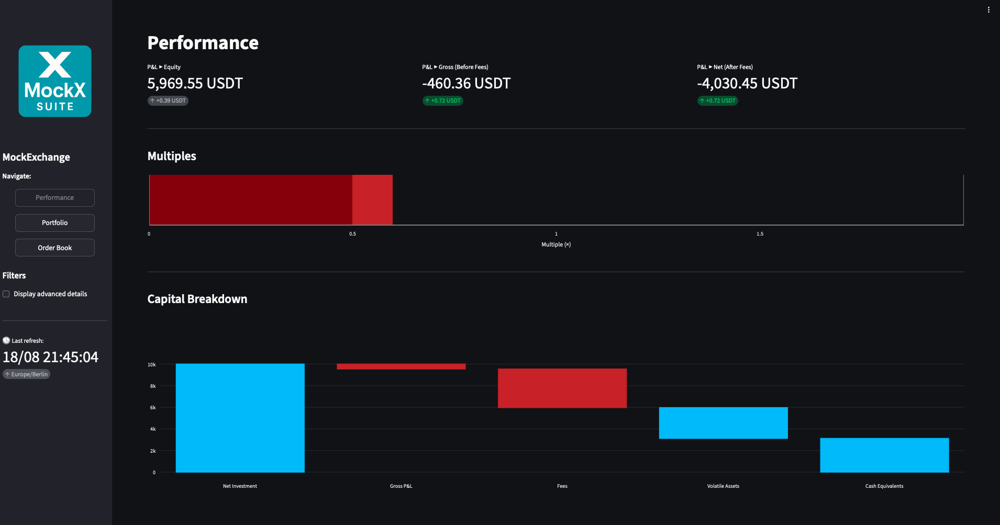

# MockX Periscope

**MockX Periscope** is the web dashboard for the MockExchange suite, providing a real-time interface to monitor portfolios, orders, and trading activity.

## Overview

MockX Periscope provides:

- **Portfolio Dashboard** - Real-time balance overview and asset allocation
- **Order Management** - View and track order status and execution
- **Order Details** - Detailed view of individual orders with complete history
- **Performance Analytics** - Comprehensive trading activity and performance metrics
- **Real-time Updates** - Auto-refresh with configurable intervals
- **Responsive Design** - Works on desktop and mobile devices
- **Streamlit UI** - Modern, clean interface built with Streamlit

## Quick Start

The Periscope dashboard is part of the full MockExchange stack. See the [main README](../../README.md) for complete setup instructions.

### **Individual Service Management**
```bash
# Start just the dashboard (requires Engine)
make start-periscope

# View dashboard logs
make logs-periscope

# Check dashboard status
make status
```

### **Access the Dashboard**
Once running, the dashboard is available at:
- **Local**: http://localhost:8501
- **Docker**: http://localhost:8501

## Configuration

The dashboard uses environment variables from the root `.env` file. Key variables include:

| Variable          | Default                 | Description                  |
| ----------------- | ----------------------- | ---------------------------- |
| `API_URL`         | `http://localhost:8000` | Engine API URL               |
| `API_KEY`         | `dev-key`               | Authentication key           |
| `REFRESH_SECONDS` | `60`                    | Auto-refresh interval        |
| `QUOTE_ASSET`     | `USDT`                  | Portfolio valuation currency |
| `APP_TITLE`       | `MockExchange`          | Dashboard title              |

**Note**: For Docker deployment, `API_URL` should be `http://engine:8000`. For local development, use `http://localhost:8000`.

See the [main README](../../README.md#-environment-configuration) for the complete configuration guide.

## Features

### **Portfolio Page**


- **Asset Balances** - Free, used, and total balances for each asset
- **Portfolio Value** - Total value in quote currency (USDT)
- **Asset Allocation** - Interactive pie chart showing portfolio distribution
- **Performance Metrics** - PnL and percentage changes
- **Real-time Updates** - Auto-refresh with configurable intervals

### **Order Book Page**


- **Order List** - All orders with status, price, and execution details
- **Filtering** - Filter by status, symbol, side, and time range
- **Real-time Updates** - Live order status changes
- **Order Details** - Click any order to view complete information and history
- **Interactive Navigation** - Seamless navigation between different views

### **Order Details Page**


- **Complete Order Information** - Full order details including creation time, execution time, and status
- **Order History** - Complete execution history with timestamps and prices
- **Trade Breakdown** - Detailed view of all trades that fulfilled the order
- **Navigation Integration** - Easy return to main views with contextual navigation buttons
- **Real-time Data** - Live updates of order status and execution details

### **Performance Page**


- **Trade Statistics** - Aggregated trading metrics and performance indicators
- **Performance Charts** - Visual representation of trading activity over time
- **Asset Performance** - Individual asset performance tracking and analysis
- **Historical Data** - Comprehensive view of trading history and patterns

## Architecture

### **Frontend**
- **Streamlit** - Web framework for data apps
- **Plotly** - Interactive charts and visualizations
- **Responsive Design** - Mobile-friendly interface

### **Backend Integration**
- **REST API** - Communicates with MockX Engine
- **Real-time Updates** - Polling-based data refresh
- **Authentication** - API key-based security

## Development

### **Local Development**
```bash
# Install dependencies
poetry install

# Run locally
streamlit run app/main.py
```

### **Adding New Pages**
1. Create new module in `app/_pages/`
2. Add navigation in `app/main.py`
3. Implement API calls in `app/services/api.py`

### **Customization**
- **Styling** - Modify `app/_pages/_colors.py`
- **Configuration** - Update `app/config.py`
- **API Integration** - Extend `app/services/api.py`


## Dependencies

- **Streamlit** - Web application framework
- **Plotly** - Interactive visualizations
- **Requests** - HTTP client for API calls
- **Python-dotenv** - Environment variable management

